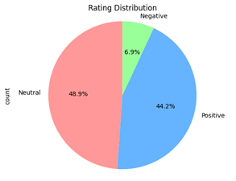

The given dataset is effectively transformed into another rating column with a simpler representation of sentiment and creating a corresponding sentiment label. 
The bar graph shows how the distribution of the data and shows most of the reviews are positive, relating to the observation to what's commonly known as the "Pareto Principle". It's important to experiment with different strategies and combinations thereof to find the most effective approach for your specific dataset and machine learning task. 

Fig: Bar Graph and Pie Chart of Data Distribution
Apart from this, the histograms shows the distribution of text lengths for different rating levels, ranging from 1 to 5. Most text lengths are clustered around shorter lengths, with a sharp decline as the length increases. There are a few instances of much longer texts, but they are very rare. 
   
Fig: Distribution Plot
This signifies that people delivering poor feedback are less likely to write shorter words. Text lengths here also peak at shorter lengths and decrease as the length grows. However, compared to the poorer ratings, there is a marginally higher occurrence of longer texts, though still relatively rare signifying that people delivering positive feedback are less likely to write longer words.

Model
The TF-IDF (Term Frequency-Inverse Document Frequency) technique was used to convert text data into numerical features, which are then used to train a Logistic Regression, Catboost classifier, Multi-Layer Perceptron model for text classification. TF-IDF is employed to reflect the importance of words in each document across a collection or corpus. After transforming both the training and test datasets, models were trained on the TF-IDF transformed training data. This model was then used to predict classifications on the test set. Finally, the result of the Logistic model was found to be:
	Precision	Recall	F1-score
Negative	.80	.52	.63
Neutral	.73	.77	.75
Positive	.76	.76	.76

  
Fig: Confusion Matrix and ROC Curve
A ROC curve for multiclass classification involves handling multiple classes, by converting the problem into multiple binary classification problems. Each curve in ROC shows the trade-off between the True Positive Rate (TPR) and False Positive Rate (FPR) for each class. The area under each ROC curve indicates the model’s ability to distinguish between the positive class, neutral class and the negative classes
Deployment
In this deployment project, model was saved in the joblib format for efficient serialization. For the web application framework, Streamlit due to its user-friendly interface and rapid deployment capabilities was chosen. The Streamlit app was designed to allow users to input text and receive sentiment predictions based on the trained model. This setup enables seamless interaction with the sentiment analysis model through a straightforward and intuitive web interface.

 
Fig: Deployment of the model
